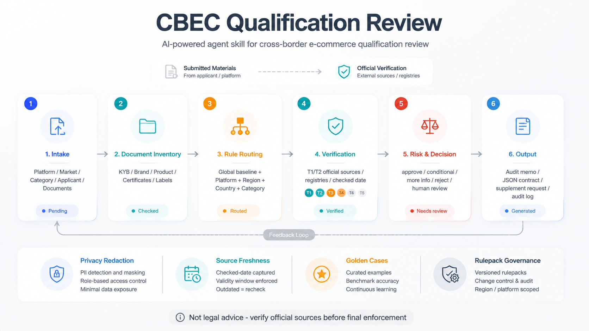

<div align="center">

# cbec-qualification-review

**An AI pre-launch checkup for cross-border products: decide whether a product can sell, is worth launching, and what must be fixed before listing.**

[中文](./README.md)

[](./SKILL.md)
[](#)
[](https://www.python.org/)
[](./scripts/qualification_audit_schema.py)

2nd place project at an International Food Expo hackathon, now open sourced.

</div>

---

Use it with a product idea, target market, marketplace, packaging label, certificate report, or brand document. It surfaces the issues sellers repeatedly miss: platform admission, competitor pricing, packaging and label readiness, logistics budget, qualification gaps, and remediation tasks.

## The Three Things Sellers Get Stuck On

- **Marketplace review blocks**: what does Amazon / TikTok Shop / Shopee / Temu need, and which authorization, label, or certificate is insufficient?
- **Pre-listing uncertainty**: is the product restricted, certification-heavy, label-sensitive, hard to ship, or dependent on a local responsible party?
- **Pricing without evidence**: who are the competitors, where is the price band, and how should packaging and positioning differentiate?

## What You Can Ask Directly

```text
Is this olive oil suitable for Amazon US? Review competitors, pricing, packaging, logistics, and listing risks.
```

```text
This skincare product is going to TikTok Shop Malaysia. What documents are needed and what label risks exist?
```

```text
For this electronics product entering the EU, should we use air freight, sea freight, or overseas warehouse?
```

```text
The marketplace asked for brand authorization and lab reports. Tell me what is actually missing and draft a supplement request.
```

```text
Based on these competitor screenshots and product details, suggest price band, channels, packaging angles, and launch preparation tasks.
```

## What It Gives You

| Output | Problem Solved |
| --- | --- |
| Launch feasibility | Can this product sell, and where might it get blocked? |
| Competitor and price band | How to price and differentiate |
| Packaging and label suggestions | How to adjust front/back label, claims, marks, warnings, and localization |
| Marketplace admission checklist | What Amazon / TikTok Shop / Shopee / Temu and similar platforms require |
| Logistics budget comparison | How to choose air, sea, rail, overseas warehouse, or local delivery |
| Qualification and certificate review | Whether business registration, brand authorization, trademark, COA, SDS, and lab reports match |
| Remediation wording | Clear requests for suppliers, sellers, or service providers |

## Frequent Use Cases

| Scenario | Why It Is Frequent | Typical Output |
| --- | --- | --- |
| New product launch review | Every new listing needs market, platform, and compliance risk checks | Launch feasibility, risks, materials, next actions |
| Marketplace/category review block | Sellers often get stuck on qualification, authorization, or label requests | Gap explanation, supplement list, applicant-facing wording |
| Competitor and pricing refresh | Pricing and positioning change repeatedly | Competitor table, channel price bands, differentiation advice |
| Packaging and label localization | Food, cosmetics, electronics, and household goods often need local packaging changes | Label suggestions, warning/claim/certification checks |
| Logistics route selection | Cost, time, restrictions, and cash tied up directly affect margin | Air/sea/rail/warehouse comparison |
| Internal review SOP | Teams need reusable operating rules and audit trails | Rule matrix, JSON output, audit log, review records |

## How It Decides



<details>
<summary>Structured Decision Statuses</summary>

| Status | Meaning |
| --- | --- |
| `approve` | Current evidence and verification support moving forward. |
| `conditional_approve` | Can proceed after bounded low/medium fixes are completed. |
| `request_more_info` | Material evidence is missing, unverifiable, or out of scope. |
| `reject` | Confirmed serious non-compliance, prohibited product, unauthorized sale, or unfixable invalid material. |
| `escalate_human` | Suspected fraud, sanctions/export-control concern, sensitive identity issue, legal ambiguity, or conflicting authoritative sources. |
| `not_applicable` | The requested review does not apply to the given platform, market, category, or purpose. |

</details>

## Safety And Scope

This project supports cross-border product launch review, marketplace listing preparation, qualification review, material pre-review, remediation drafting, and internal process design. It does not provide legal advice and does not replace final judgment from marketplaces, regulators, certification bodies, or professional compliance advisors.

When documents contain identity records, bank accounts, personal contact details, contracts, business registration numbers, or other sensitive data, follow [`references/privacy-security.md`](./references/privacy-security.md) for minimization, redaction, and audit records.

## Installation

### Codex

```bash
mkdir -p ~/.codex/skills
cp -R /path/to/cbec-qualification-review ~/.codex/skills/cbec-qualification-review
```

### Claude Code

```bash
mkdir -p ~/.claude/skills
cp -R /path/to/cbec-qualification-review ~/.claude/skills/cbec-qualification-review
```

Restart the corresponding agent after installation so the skill metadata reloads.

## Runnable Local Capabilities

This repository is not only prompt documentation. It includes executable review helpers:

```bash
python3 scripts/qualification_audit_schema.py checklist --platform amazon --market US --category food
```

Generate a platform/market/category checklist.

```bash
python3 scripts/qualification_audit_schema.py review-skeleton \
  --platform amazon \
  --market US \
  --category food \
  --applicant-name "Example Trading Co., Ltd." \
  --applicant-role distributor \
  --business-model marketplace_seller \
  --brand-name "Example Brand" \
  > /tmp/cbec_review_skeleton.json
```

Generate a structured intake review that follows the JSON contract, including scope, requirements, sources, findings, missing materials, remediation wording, and audit log. The default decision is `request_more_info` because a final approval is not allowed before submitted materials are matched to evidence and current sources.

```bash
python3 scripts/qualification_audit_schema.py validate /tmp/cbec_review_skeleton.json
python3 scripts/qualification_audit_schema.py case-check cases/golden-unverified-applicant-docs.json /tmp/cbec_review_skeleton.json
python3 scripts/qualification_audit_schema.py golden-replay
python3 scripts/qualification_audit_schema.py source-freshness
python3 scripts/qualification_audit_schema.py quality-gate
```

All indexed rule-pack requirements now have attached sources. `source-freshness` should return:

```text
checked_source_links: 116
unverified_requirements: []
stale: []
missing: []
```

Three high-frequency routes have deeper T1 official source coverage:

- `Amazon + US + food`: Amazon Seller Central, FDA, CBP
- `TikTok Shop + ASEAN/Malaysia + cosmetics`: TikTok Shop Seller Center, ASEAN, Singapore HSA, Malaysia NPRA
- `Temu + electronics`: Temu official entry points/terms/safety recall page, FCC, European Commission, CPSC

Shopee, Lazada, AliExpress, Tmall Global, EU, UK, Japan, China import, supplements, and household chemicals also now include official or authoritative source entry points. Note that pack maturity is still `seed`: source coverage does not mean automatic final approval is safe. Promotion to `validated` or `production` still requires more golden cases, real-case replay, and human review sampling.

The repository also includes 7 produced review fixtures covering approve, request_more_info, reject, escalate_human, expired certificate, territory mismatch, and unverified evidence paths. Run `golden-replay` to check them in batch.

Before publishing, run `quality-gate` to check the rulepack index, source freshness, and golden replay in one command.

See [`examples/README.md`](./examples/README.md) for runnable examples.
