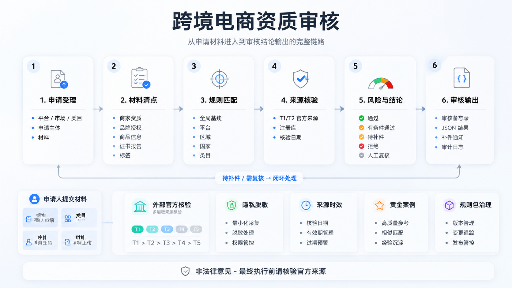
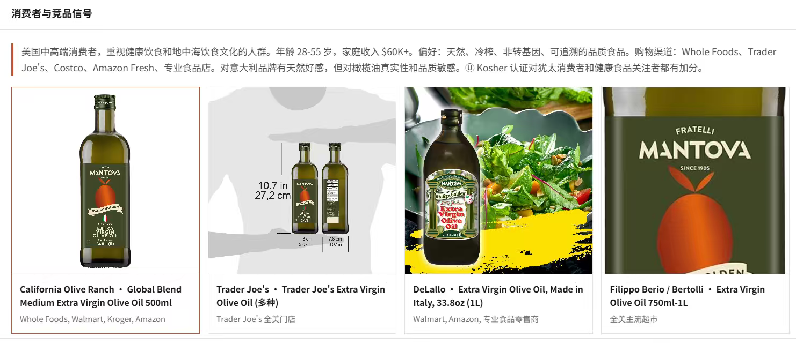
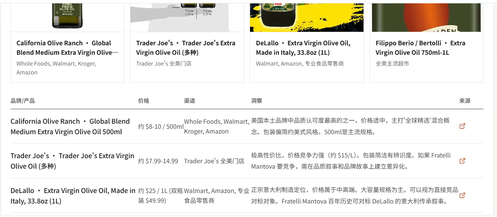
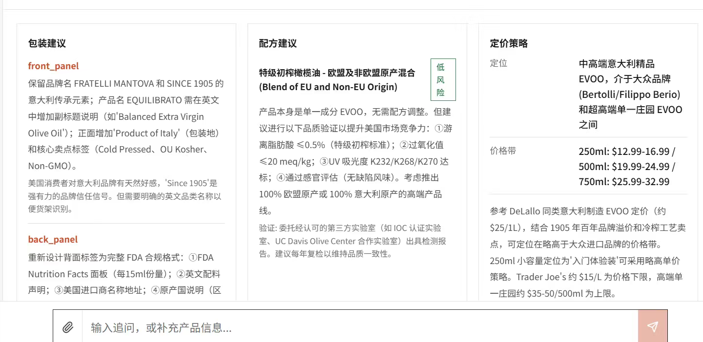
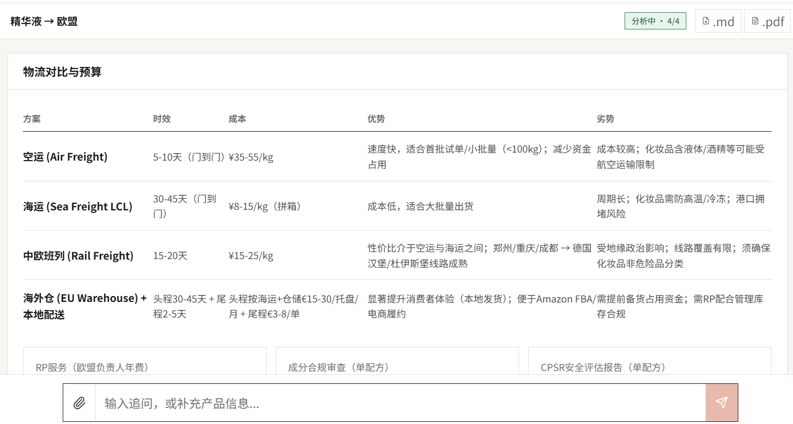

<div align="center">

# cbec-qualification-review

**面向跨境电商卖家、品牌、商品、证书与平台准入材料的可审计资质审核 Agent Skill。**

[English](./README.en.md)

Claude Code / Codex / OpenClaw / Hermes 等支持 Skills 的 agent 均可使用。装进 agent 后，可以用自然语言审核商家入驻、类目准入、品牌授权、产品合规文件、证书有效性和平台补件材料，输出可追溯的通过、补件、拒绝或人工升级结论。

[](./SKILL.md)
[](https://www.python.org/)
[](./scripts/qualification_audit_schema.py)

</div>

---

## 能做什么

- **商家/KYB 审核**：营业执照、税务登记、收款主体、受益人、店铺申请主体和服务商资质。
- **品牌/IP 审核**：商标证书、品牌授权书、分销协议、授权链、销售地区、平台/渠道范围和有效期。
- **商品/类目准入**：食品、保健品、化妆品、电子电器、家化等类目的准入材料、限制品和禁售风险。
- **证书/报告核验**：CE、FCC、COA、SDS/MSDS、ISO、HACCP、Halal、Organic、检测报告等文件的主体、范围、日期、签发方和产品匹配。
- **平台规则路由**：按 Amazon、TikTok Shop、Shopee、Temu、Lazada、AliExpress、Tmall Global 等平台生成审核清单。
- **补件与整改**：把缺失、过期、不一致或无法核验的材料转成申请人可读的补件话术。
- **结构化审计输出**：使用固定 JSON contract、证据表、来源层级、风险等级、决策状态和 audit log 支撑复核。

## 适合哪些场景

| 场景 | 适合程度 | 说明 |
| --- | --- | --- |
| 商家入驻材料初审 | 很适合 | 能把主体、平台、市场、类目、材料清单和缺口先梳理出来。 |
| 品牌授权链审核 | 很适合 | 重点检查授权方权限、被授权方、品牌、地区、平台、品类和有效期。 |
| 证书/检测报告形式审查 | 很适合 | 能识别过期、主体不一致、产品型号不匹配、签发方不明等问题。 |
| 平台类目准入 checklist | 适合 | 可用规则包生成初始清单，但最终要求必须查官方来源。 |
| 内部审核流程设计 | 适合 | 已提供数据模型、状态机、证据链和补件模板。 |
| 直接替代法务/合规最终意见 | 不适合 | 本 skill 是运营资质审核框架，不是法律意见或监管最终解释。 |

## 核心决策状态

skill 的最终结论固定为六类，便于系统集成和复核：

| 状态 | 含义 |
| --- | --- |
| `approve` | 关键要求已满足，无高风险阻断项。 |
| `conditional_approve` | 仅剩低/中风险、边界清楚且可补正的问题。 |
| `request_more_info` | 关键材料缺失、无法核验或范围不完整，暂不能判断。 |
| `reject` | 已确认严重不合规、禁售、无权销售、材料失效且不可补正等问题。 |
| `escalate_human` | 疑似造假、制裁/出口管制、身份敏感、法律歧义或官方来源冲突。 |
| `not_applicable` | 请求范围不适用于给定平台、市场、类目或审核目的。 |

## 整体项目逻辑图



## 中文效果示意

以下示意图展示中文业务场景下的输出形态：从消费者与竞品信号，到渠道价格、包装标签、配方建议、定价策略和物流预算，都可以被整理成便于运营、审核和补件沟通的结构化页面。

### 消费者与竞品信号



### 竞品价格与渠道洞察



### 包装、配方与定价建议



### 美国零售货架概念


### 物流对比与预算



## 安装

### Codex

```bash
mkdir -p ~/.codex/skills
cp -R /path/to/cbec-qualification-review ~/.codex/skills/cbec-qualification-review
```

### Claude Code

```bash
mkdir -p ~/.claude/skills
cp -R /path/to/cbec-qualification-review ~/.claude/skills/cbec-qualification-review
```

安装后重启对应 agent，让 skill 元数据重新加载。

## 使用示例

```text
用 cbec-qualification-review 帮我审核这个 Amazon US 食品类目入驻包，判断能否通过并列出补件项。
```

```text
用 cbec-qualification-review 检查这份品牌授权书是否覆盖 TikTok Shop 马来西亚站和护肤品类目。
```

```text
用 cbec-qualification-review 给 Temu 电子产品供应商准入设计一套审核 checklist。
```

```text
用 cbec-qualification-review 把这批营业执照、商标证书、COA、SDS 和检测报告整理成结构化审核 JSON。
```

```text
用 cbec-qualification-review 根据当前材料写一封申请人补件通知，语气要适合运营发给商家。
```

## 安全与边界

本项目用于跨境电商资质审核、材料初审、补件生成和内部流程设计，不提供法律意见，也不替代平台、监管机构、认证机构或专业合规顾问的最终判断。

含身份证件、银行账户、个人联系方式、合同、营业执照编号等敏感信息时，应按 [`references/privacy-security.md`](./references/privacy-security.md) 做最小化展示、脱敏和审计记录。
