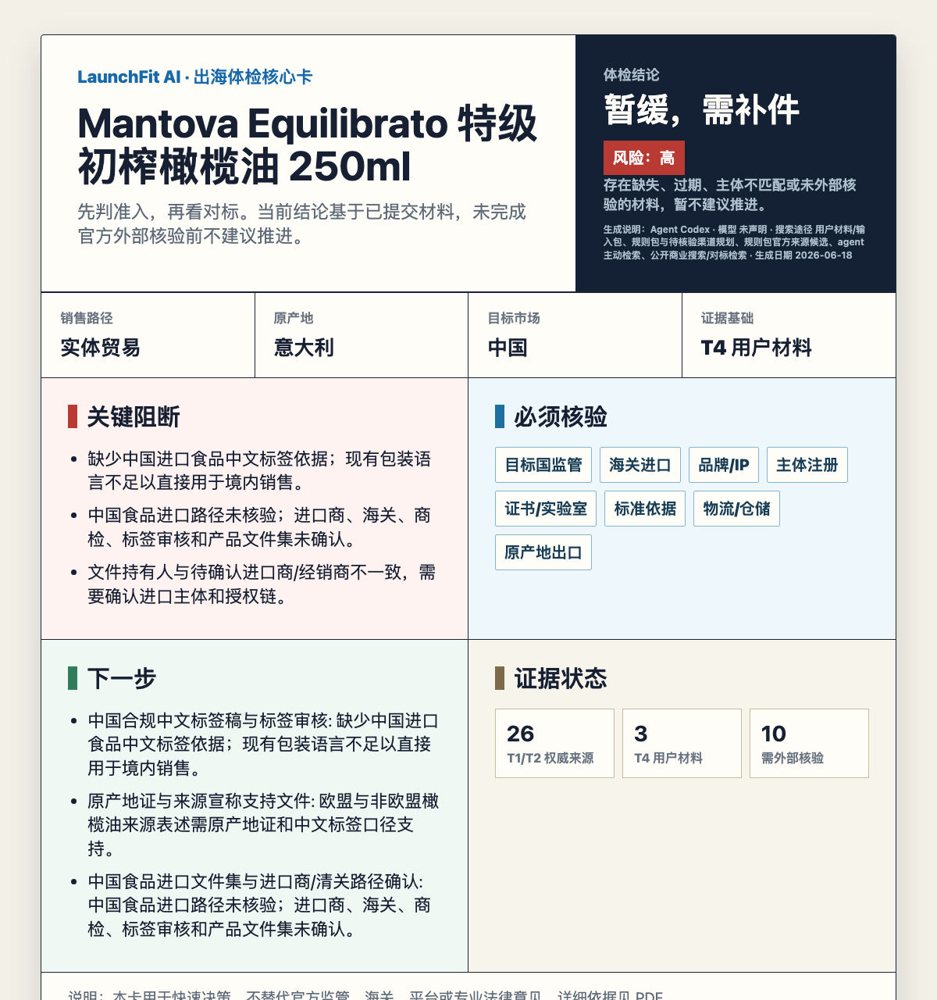

# 出海体检官

**先判断能不能卖，再判断怎么卖：给你的跨境商品做一次卖前 AI 体检。**

[English](./README.en.md)

国际食品展黑客松第二名项目，现已开源。

---

跨境上架最贵的错误，往往不是选品错了，而是**货已经备好，平台才告诉你资质不够、授权不覆盖、标签要改、类目不能卖**。

出海体检官把“我这个品能不能出海”变成一份可执行的 AI 体检报告。给它一个商品、原产地、一个或多个目标市场、销售路径、平台或线下渠道、包装标签、证书报告、品牌材料，或几张当地竞品截图，它会先帮你判断：这是跨境电商、实体贸易，还是两者混合；再做准入风险粗筛，找清楚每个目标市场应该查哪些官方渠道、用户渠道和对标信息；最后判断哪里能推进，哪里要补件，哪里可能亏钱，哪里必须停下来复核。

## 你需要提供什么

最少只需要：

- **原产地**：商品在哪里生产、组装或出口。
- **目标市场**：想卖到哪里，支持多个国家或区域。
- **销售路径和类目**：跨境电商、实体出口/进口分销，或两者混合；例如 Amazon US food、Temu EU electronics、TikTok Shop ASEAN cosmetics，或出口到美国进口商/经销商。
- **商品信息**：名称、规格、成分/材料、功能宣称、品牌、包装文案。

如果已经有材料，可以继续补充：证书/检测报告、品牌授权、包装图片、竞品链接/截图、物流报价、供应商信息、平台搜索链接、行业数据库或内部审核记录。

## 它会输出什么

- **每个目标市场的审核路径**：不会把 US、EU、Japan 混成一个清单。
- **销售路径分流**：跨境电商优先看平台准入、类目审核、Listing、履约；实体贸易优先看出口、进口、清关、责任方、经销/零售渠道；混合路径两套分开评估。
- **最合适的信息渠道**：平台政策、监管机构、海关进口、品牌/IP、企业注册、认证/实验室、标准、物流仓储、原产地出口控制，以及你提供的搜索渠道。
- **可执行核验任务**：查什么、为什么查、优先级、证据字段、刷新周期和来源层级。
- **目标市场对标**：当地类似商品的价格、规格、包装、卖点、渠道、认证和评论信号。
- **上架风险和资质缺口**：平台、市场、类目、品牌、标签、证书、物流分别卡在哪里。
- **补件话术和复核记录**：方便直接发给供应商、客户、服务商或内部审核同事。

## 为什么它不是普通“建议”

- 先确认原产地、目标市场、销售路径、平台或线下渠道、类目、业务模式、申请人角色、品牌/IP 和材料范围，再给判断。
- 不假装离线知道最新政策；需要实时确认的事项会输出 `needs_external_verification`。
- 用户提供的截图、证书、报价、平台链接和行业数据库会进入 `user_search_channels`、`source_candidates`、`research_tasks` 或 `external_checks`，但不会默认当成官方事实。
- 每个风险都落到 severity、evidence、source、impact、required action，方便人工复核。
- 缺范围、缺材料、材料过期、授权不覆盖、疑似造假或官方来源冲突时，不会硬给通过，会输出补件、拒绝或人工升级。

## 它解决的核心问题

- **上架前不确定**：这个品在 Amazon / TikTok Shop / Shopee / Temu / Lazada / AliExpress / Tmall Global 能不能卖？
- **销售路径不清楚**：这是平台跨境电商、传统出口/进口分销，还是线上线下都要做？
- **平台卡审说不清**：到底缺品牌授权、检测报告、标签、证书，还是主体/地区/类目不匹配？
- **找不到对标**：目标市场同类商品怎么定价、怎么包装、主打什么卖点、在哪些渠道卖？
- **包装和宣称有风险**：正背标、成分、过敏原、警示、认证标识、责任方、语言和功效宣称哪里要改？
- **定价和物流没依据**：竞品是谁、价格带在哪、空运/海运/海外仓会不会吃掉利润？
- **团队审核口径不一致**：每个人都凭经验判断，补件话术、证据记录和复核链路难统一。

## 体检报告长什么样

| 报告模块 | 用户拿到的结论 |
| --- | --- |
| 出海体检结论 | go / caution / stop / unknown，一眼看出这个品是否值得继续推 |
| 销售路径判断 | 跨境电商、实体贸易、混合路径分别优先查什么 |
| 目标市场对标 | 当地类似商品的价格、规格、包装、卖点、渠道、认证和评论信号 |
| 上架风险清单 | 平台、市场、类目、品牌、标签、证书、物流分别卡在哪里 |
| 资质缺口表 | 哪份材料缺、哪份过期、哪份主体/地区/类目/型号不匹配 |
| 包装标签建议 | 正背标、成分、过敏原、警示语、认证标识、本地化语言和功效宣称怎么改 |
| 价格与定位 | 价格带、单位价格、渠道层级、包装卖点和差异化机会 |
| 物流预算判断 | 空运、海运、海外仓、本地配送的成本、时效和风险 |
| 补件话术 | 可直接发给供应商、客户或服务商的材料请求 |
| 复核记录 | 结论、证据、来源、缺口和下一步动作，方便团队交接 |

## 真实运行示例

下面的示例不是手工 mock。输入图片、结构化 bundle、JSON 报告、核心卡片和 PDF 都保存在仓库里，可以复现。

### 示例 1：Mantova 橄榄油进口到中国

- 商品：Fratelli Mantova Equilibrato Extra Virgin Olive Oil 250ml
- 目标：从意大利进口到中国
- 销售路径：`physical_trade`
- 输入依据：3 张商品实拍图，属于 T4；同时由 agent 主动检索公开商业渠道，补入 10 条中国市场橄榄油对标样本。对标只作为市场信号，不伪装成监管、进口或标签核验结果。
- 产物：[输入 bundle](./examples/real-runs/mantova-olive-oil-china-import/input-bundle.json)、[结构化报告 JSON](./examples/real-runs/mantova-olive-oil-china-import/outputs/report.json)、[详细 PDF](./examples/real-runs/mantova-olive-oil-china-import/outputs/detailed-report.pdf)

核心速览卡片：

## 适合谁

- **跨境卖家 / 品牌方**：在打样、备货、投流前，先知道这个品是否值得继续。
- **选品和运营团队**：不只看销量和价格，把准入、包装、物流、合规成本一起纳入判断。
- **合规 / 资质审核团队**：把审核口径变成固定状态、证据表、缺口表和可复核记录。
- **服务商 / 代运营**：快速判断客户材料哪些能用、哪些必须重开，减少反复沟通。

## 覆盖范围

- 平台：Amazon、TikTok Shop、Shopee、Temu、Lazada、AliExpress、Tmall Global
- 市场 / 区域：US、EU / EEA、UK、Japan、China import、ASEAN / Southeast Asia
- 类目：food、cosmetics、supplements、electronics、household chemicals

规则来源连接到 Amazon Seller Central、TikTok Shop Seller Center、FDA、CBP、European Commission、FCC、CPSC、ASEAN、Singapore HSA、Malaysia NPRA、GOV.UK、MHLW、METI、GACC、SAMR、NMPA、WIPO、EUIPO、USPTO 等官方或权威入口。

## 它怎么判断

新版判断顺序不是“先找对标”。它先锁定销售路径，再查准入风险，最后再做对标和商业判断：

1. **锁定范围**：原产地、目标市场、销售路径、平台或线下渠道、类目、商品、申请人角色。
2. **销售路径分流**：跨境电商优先查平台准入、类目、Listing、履约；实体贸易优先查出口、进口、清关、责任方、经销/零售渠道；混合路径两套分开跑。
3. **准入风险粗筛**：禁限售、注册/备案、标签、宣称、品牌授权、证书、清关、物流和责任方。
4. **信息渠道规划**：官方监管、海关、标准、认证、品牌/IP、企业注册、物流仓储、用户提供渠道。
5. **目标市场对标**：只有在“能不能卖”的关键风险被识别后，再看当地类似商品的价格、包装、渠道、卖点和评论信号。
6. **交付产物**：核心速览卡片 + 详细 PDF，所有结论标注证据层级和是否需要外部核验。

结构化结论状态

| 状态 | 含义 |
| --- | --- |
| `approve` | 当前材料和核验结果支持推进。 |
| `conditional_approve` | 可以推进，但需要完成边界清楚的低/中风险补正。 |
| `request_more_info` | 关键信息或材料缺失，暂不能判断。 |
| `reject` | 已确认禁售、严重不合规、无权销售、材料失效且不可补正等问题。 |
| `escalate_human` | 疑似造假、制裁/出口管制、身份敏感、法律歧义或官方来源冲突。 |
| `not_applicable` | 请求范围不适用于给定平台、市场、类目或审核目的。 |

## 🙏 致谢

### 核心贡献者

- [刘申奥](https://v.douyin.com/2i9vkcO2jl4/) 
- [光城](https://github.com/light-city) 
- [tobin](https://github.com/TobinZuo) 
- [梁馨匀](https://github.com/halobaby0917-maker) 
- [June](https://github.com/JuneYaooo) 
