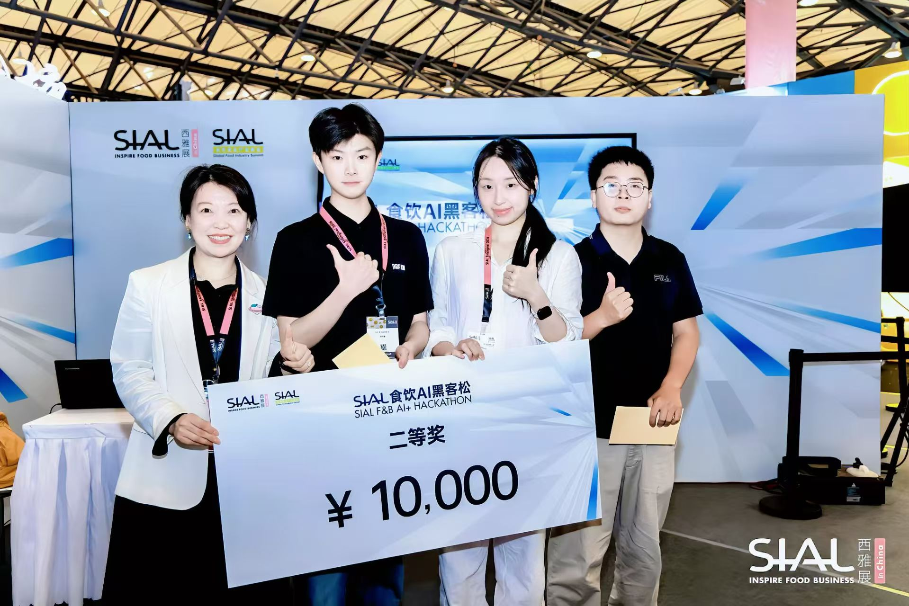

<div align="center">

# 出海体检官

**先判断能不能卖，再判断怎么卖：给你的跨境商品生成一份卖前详细体检报告。**

[English](./README.en.md)

[](./SKILL.md)
[](#)
[](./LICENSE)

国际食品展黑客松第二名项目，现已开源。

这是一个可安装到 Codex / Claude Code / OpenClaw / Hermes 等支持 Skills 的 agent 里的 **Agent Skill**。装好后，你可以直接用自然语言让 agent 为跨境商品生成卖前详细体检报告。



</div>

---

跨境上架最贵的错误，往往不是选品错了，而是**货已经备好，平台才告诉你资质不够、授权不覆盖、标签要改、类目不能卖**。

出海体检官把“我这个品能不能出海”变成一份可执行的详细体检报告。给它一个商品、原产地、一个或多个目标市场、销售路径、平台或线下渠道、包装标签、证书报告、品牌材料，或几张当地竞品截图，它会同时回答三件事：**准入体检**看出口、进口、平台、资质、标签和物流有没有硬门槛；**目标市场对标**看当地类似商品怎么定价、包装、表达卖点、建立信任；**本地化建议**告诉你包装、文案、渠道、价格、履约和补件应该怎么改。最后报告会判断哪里能推进，哪里要补件，哪里可能亏钱，哪里必须停下来复核。

## 适合谁

- **跨境卖家 / 品牌方**：在打样、备货、投流前，先知道这个品是否值得继续。
- **选品和运营团队**：不只看销量和价格，把准入、包装、物流、合规成本一起纳入判断。
- **合规 / 资质审核团队**：把审核口径变成固定状态、证据表、缺口表和可复核记录。
- **服务商 / 代运营**：快速判断客户材料哪些能用、哪些必须重开，减少反复沟通。

## 你需要提供什么

最少只需要：

- **原产地**：商品在哪里生产、组装或出口。
- **目标市场**：想卖到哪里，支持多个国家或区域。
- **销售路径和类目**：跨境电商、实体出口/进口分销，或两者混合；例如 Amazon US food、Temu EU electronics、TikTok Shop ASEAN cosmetics，或出口到美国进口商/经销商。
- **商品信息**：名称、规格、成分/材料、功能宣称、品牌、包装文案。

如果已经有材料，可以继续补充：证书/检测报告、品牌授权、包装图片、竞品链接/截图、物流报价、供应商信息、平台搜索链接、行业数据库或内部审核记录。

## 你会拿到什么产物

- **详细体检报告**：一份可复核的完整报告，覆盖目标市场、销售路径、出口/进口/平台准入风险、对标样本、本地化建议、包装标签、资质缺口、物流预算、补件话术和下一步动作。
- **核心速览卡片**：把详细体检报告压缩成一屏决策卡，方便发给老板、客户、供应商、运营或合规同事。

## 详细体检报告会输出什么

- **每个目标市场的审核路径**：不会把 US、EU、Japan 混成一个清单。
- **销售路径分流**：跨境电商优先看平台准入、类目审核、Listing、履约；实体贸易优先看出口、进口、清关、责任方、经销/零售渠道；混合路径两套分开评估。
- **最合适的信息渠道**：平台政策、监管机构、海关进口、品牌/IP、企业注册、认证/实验室、标准、物流仓储、原产地出口控制，以及你提供的搜索渠道。
- **可执行核验任务**：查什么、为什么查、优先级、证据字段、刷新周期和来源层级。
- **目标市场对标**：当地类似商品的价格、规格、包装、卖点、渠道、认证和评论信号。
- **本地化落地建议**：包装层级、标签语言、声明文案、卖点表达、渠道打法、价格带、履约路径和差异化机会。
- **上架风险和资质缺口**：平台、市场、类目、品牌、标签、证书、物流分别卡在哪里。
- **补件话术和复核记录**：方便直接发给供应商、客户、服务商或内部审核同事。

## 为什么它不是普通“建议”

- 先确认原产地、目标市场、销售路径、平台或线下渠道、类目、业务模式、申请人角色、品牌/IP 和材料范围，再给判断。
- 不假装离线知道最新政策；需要实时确认的事项会输出 `needs_external_verification`。
- 用户提供的截图、证书、报价、平台链接和行业数据库会进入 `user_search_channels`、`source_candidates`、`research_tasks` 或 `external_checks`，但不会默认当成官方事实。
- 每个风险都落到 severity、evidence、source、impact、required action，方便人工复核。
- 缺范围、缺材料、材料过期、授权不覆盖、疑似造假或官方来源冲突时，不会硬给通过，会输出补件、拒绝或人工升级。

## 它解决的核心问题

- **上架前不确定**：这个品在 Amazon / TikTok Shop / Shopee / Temu / Lazada / AliExpress / Tmall Global 能不能卖？
- **销售路径不清楚**：这是平台跨境电商、传统出口/进口分销，还是线上线下都要做？
- **平台卡审说不清**：到底缺品牌授权、检测报告、标签、证书，还是主体/地区/类目不匹配？
- **找不到对标**：目标市场同类商品怎么定价、怎么包装、主打什么卖点、在哪些渠道卖？
- **本地化不知道怎么改**：正背标、语言、规格、卖点、视觉层级、认证标识、责任方和渠道表达如何贴近当地买家？
- **包装和宣称有风险**：成分、过敏原、警示、认证标识、责任方、语言和功效宣称哪里要改？
- **定价和物流没依据**：竞品是谁、价格带在哪、空运/海运/海外仓会不会吃掉利润？
- **团队审核口径不一致**：每个人都凭经验判断，补件话术、证据记录和复核链路难统一。

## 安装

把下面这段发给你的 Codex / Claude Code / OpenClaw / Hermes Agent，或其他支持 Skills 的 agent：

```text
帮我安装 LaunchFit AI / 出海体检官 这个 Skill：
https://github.com/JuneYaooo/launchfit-ai
```

agent 会把仓库克隆到本地，并放到它自己的 skills 目录。安装后重启 agent 或刷新 skills 列表即可使用。

## 怎么使用

装好后，直接对 agent 说自然语言即可。比如：

```text
用 LaunchFit AI 帮我评估这个商品能不能卖到美国 Amazon：
原产地：中国
目标市场：美国
销售路径：Amazon US 跨境电商
类目：food
商品：辣椒酱，含配料表和包装文案
请输出详细体检报告，重点看准入风险、目标市场对标、本地化建议、包装标签、资质缺口和下一步动作。
```

也可以把证书、包装图、竞品截图、平台链接、物流报价、供应商信息一起给 agent。它会把用户材料标成 T4 证据，把需要实时确认的政策、价格、资质、物流和监管信息标成 `needs_external_verification`，不会把截图或供应商说法直接当成官方事实。

## 现在可以怎么试

1. 先安装这个 Skill。
2. 准备商品原产地、目标市场、销售路径、类目和包装/资质材料。
3. 直接让 agent 输出一份“详细体检报告”和“核心速览卡片”。

把你的资料丢给 AI，让它帮你的产品做一次出海体检。

## 真实运行示例

### 示例 1：Mantova 橄榄油进口到中国

- 商品：Fratelli Mantova Equilibrato Extra Virgin Olive Oil 250ml
- 目标：从意大利进口到中国
- 销售路径：`physical_trade`
- 输入依据：3 张商品实拍图，属于 T4；同时由 agent 主动检索公开商业渠道，补入 10 条中国市场橄榄油对标样本。对标只作为市场信号，不伪装成监管、进口或标签核验结果。

输入图片：

| 正面标签 | 背面营养标签 | 侧面原产地标签 |
| --- | --- | --- |
|  |  |  |

核心速览卡片：


- 产物：[详细 PDF](./examples/real-runs/mantova-olive-oil-china-import/outputs/detailed-report.pdf)

## 覆盖范围

- 平台：Amazon、TikTok Shop、Shopee、Temu、Lazada、AliExpress、Tmall Global
- 市场 / 区域：US、EU / EEA、UK、Japan、China import、ASEAN / Southeast Asia
- 类目：food、cosmetics、supplements、electronics、household chemicals

规则来源连接到 Amazon Seller Central、TikTok Shop Seller Center、FDA、CBP、European Commission、FCC、CPSC、ASEAN、Singapore HSA、Malaysia NPRA、GOV.UK、MHLW、METI、GACC、SAMR、NMPA、WIPO、EUIPO、USPTO 等官方或权威入口。

## 微信交流群

如果你想交流 Skills 使用经验、申请产品试用、一起共创出海体检官，或反馈使用中的问题和建议，欢迎扫码加入微信交流群。


## 🙏 致谢

### 核心贡献者

- [刘申奥](https://v.douyin.com/2i9vkcO2jl4/) 
- [光城](https://github.com/light-city) 
- [tobin](https://github.com/TobinZuo) 
- [梁馨匀](https://github.com/halobaby0917-maker) 
- [June](https://github.com/JuneYaooo) 

### 社区

- [LINUX DO — 中文开发者社区](https://linux.do/)

## License

本项目采用 [PolyForm Noncommercial License 1.0.0](./LICENSE) 授权，**禁止商用**。

商业使用或者商务合作请联系 <juneyaooo@gmail.com>。
